# Agent-O

<p align="center">
  
</p>

<p align="center">
  <strong>Your ASCII desktop companion for Claude CLI & Codex CLI.</strong><br>
  A native macOS floating Tamagotchi that helps you code, learns, evolves, and keeps you company.
</p>

<p align="center">
  
  
  
  
  
</p>

<p align="center">
  <a href="https://egorfedorov.github.io/agentO/">Website</a> &middot;
  <a href="https://social-coral-five.vercel.app/">Leaderboard</a> &middot;
  <a href="#project-vision">Vision</a> &middot;
  <a href="#quick-start">Quick Start</a> &middot;
  <a href="#features">Features</a> &middot;
  <a href="#all-commands">Commands</a>
</p>

---

<p align="center">
  
</p>

---

## Quick Start

**Option 1: Clone & Run**
```bash
git clone https://github.com/egorfedorov/agentO.git
cd agentO
./run.sh
```

**Option 2: Homebrew**
```bash
brew tap egorfedorov/agento https://github.com/egorfedorov/agentO.git
brew install agento
agento
```

**Option 3: Download .app** from [Releases](https://github.com/egorfedorov/agentO/releases)
```bash
# After downloading, remove quarantine flag:
xattr -cr ~/Downloads/AgentO.app
# Then open AgentO.app
```

**Requirements:** macOS 12+, Swift (comes with Xcode Command Line Tools), Claude CLI or Codex CLI.

**Important command format:** all built-in commands use `/` prefix.
- Correct: `/update`, `/battle user`, `/rent publish 50 7 CyberCat`
- Incorrect: `update`, `!update`
- Friendly aliases supported: `/help all commands`, `/quests daily quests`
- Help UX: `/help` shows compact view; `/help ai|tools|pet|social|focus`; `/help all` for full list
- Input box supports direct paste (Cmd+V / right-click Paste)

## Project Vision

Agent-O is evolving from a desktop Tamagotchi into a **market of trainable specialist AI pets**.

The key idea:
- Every user trains a pet via real daily prompts and workflow.
- Pet specialization becomes visible (game dev, art, debugging, automation, docs).
- Strong specialist pets become rentable in the marketplace.
- Renters pick pets by specialization quality, not only by level.

In short: **your work makes your pet smarter**, and that specialization becomes an asset.

## Why This Matters

Most AI assistants are generic. Agent-O aims to make each pet:
- personal (learns your stack and style),
- niche-specialized (better in one domain than others),
- economically useful (can be rented for focused workflows).

Example:
- If you build Stake Engine games every day, your pet should become stronger in that domain.
- Another user may train a pet for art direction, prompt visuals, or frontend UX.
- Different pets = different strengths = real marketplace demand.

## How Specialization Works

### 1) Learning Signals
- Prompt history from Claude/Codex usage inside Agent-O.
- Repeated topics and patterns (`PromptJournal` + `PetBrain`).
- Explicit memory training via `/train <fact>` and `/teach <fact>`.
- Quality feedback loop via `/promptcoach` and `/training`.

### 2) Skill Profile (Pet DNA)
Each pet builds a profile over time:
- domain focus (e.g. game math, stake engine integration, UI, image prompting),
- consistency (how often owner works in that domain),
- prompt quality score (context clarity, output formatting habits),
- confidence/reliability indicators.

### 3) Marketplace Utility
- Owner publishes listing (`/rent publish ...`).
- Renter chooses pet by specialization and history.
- During rental, prompts are routed through that pet profile.
- Rental activity strengthens marketplace reputation.

## Earnings Model (Product Direction)

Current release provides:
- rental commands and social marketplace UX,
- rental history and active listing visibility,
- profile-level training and specialization foundation.

Planned monetization layer:
- paid rentals and owner payouts,
- specialization tiers and verified badges,
- renter reviews and performance scoring.

This gives users a path to earn from domain expertise by training high-quality pets.

## Roles in the Ecosystem

### Pet Owner (Builder)
- Trains pet on real workflows and domain prompts.
- Improves specialization profile and trust.
- Publishes rental listings and builds reputation.

### Pet Renter (User)
- Selects pet by specialization and quality history.
- Uses pet for focused tasks (game dev, art prompts, frontend, debugging, etc.).
- Pays for outcomes faster than using a generic assistant.

### Marketplace
- Matches task intent to specialist pets.
- Makes expertise discoverable and comparable.
- Creates a feedback loop where better training leads to better demand.

## New in v6.3.0

### Tactical PvP Duels
- Challenge flow is now explicit: invite -> accept/decline -> both submit move.
- Moves use zone strategy (`head`, `body`, `legs`) for both attack and defense.
- Commands:
  - `/battle <username>`
  - `/accept <username>` / `/decline <username>`
  - `/move <attackZone> <defenseZone>`

### Pet Marketplace (Rentals)
- Publish your pet as a rental listing directly from Agent-O.
- Rent other players' pets and track rental lifecycle/history.
- Commands:
  - `/market`
  - `/rent publish <pricePerDay> <maxDays> <title>`
  - `/rent take <owner> <days>`
  - `/rent my [owner|renter|both]`
  - `/rent end <rentalId>`
- Web landing:
  - Leaderboard: https://social-coral-five.vercel.app/
  - Marketplace: https://social-coral-five.vercel.app/marketplace

### Pet Training Loop
- New training dashboard and memory-training command for your pet.
- Commands:
  - `/training` — training quality dashboard
  - `/optimizer` — token optimizer status
  - `/optimizer aggressive` — stronger compression, lower token spend
  - `/specialist` — active specialist profile + signals
  - `/specialist set <key|auto>` — manual lock or auto-learning
  - `/train <fact>` — train pet memory (+XP)
  - `/promptcoach [N]` — prompt quality coaching

### Multi-Model Router
- Agent-O now supports provider routing beyond Claude/Codex.
- Providers: Claude, Codex, GPT, Gemini, Ollama.
- Commands:
  - `/model` — current provider + model status
  - `/models` — all providers + configured models
  - `/model <provider>` — set active provider
  - `/model <provider> <model-id>` — set model override
  - `/usage [N]` — usage analytics by provider

### Landing & Docs Refresh
- Landing page now highlights tactical duels, marketplace rentals, and training.
- README includes slash-command rule and pre-release checks for `/update`.

## Features

### Guided Onboarding
- First launch walks you through: Feed → Play → Ask your active provider
- Teaches core mechanics step by step
- Unlocks daily quests after completion

### Multi-Model Integration
- Send prompts to **Claude CLI**, **Codex CLI**, **OpenAI GPT**, **Gemini**, or **Ollama**
- `/model` — active provider and model status
- `/models` — available providers + configured models
- `/model <provider>` — switch default provider
- `/model <provider> <model-id>` — set model override
- `/usage [N]` — provider usage summary
- Real-time streaming output with syntax highlighting
- Clipboard analysis (`/paste`)
- Drag & drop files for instant analysis

### Tamagotchi Pet
- **Food / Joy / Energy** stats that decay over time
- **XP & Levels** — every command earns XP
- **5 Evolution stages:** Baby → Evolved → Epic → Mythic → Cosmic
- **Daily streak** bonus XP
- Pet complains when hungry, sad, or tired
- Stats persist across sessions (`~/.agento_pet.json`)

### 23 Achievements
Unlock badges for milestones — first command, 100 commands, commits, streaks, mini-games, coding at night, and more. Each achievement = +30 XP.

### Daily Quests
- 3 random quests each day (e.g., "Run 3 commands", "Win a battle", "Feed your pet")
- Bonus XP for completing all 3
- `/quests` to check progress

### Inventory
- Unlock items for milestones: crowns, halos, frames, badges, wings
- 10 collectible items tied to achievements and stats
- `/inventory` to browse your collection

### Mini-Games
- `/game` — Number guessing (1-100)
- `/trivia` — Dev trivia questions
- `/typing` — Typing speed test (WPM + accuracy)

### Pomodoro Timer
- `/pomo` — 25 min focus timer
- `/pomo10` — 10 min quick session
- `/break` — 5 min break
- +40 XP per completed pomodoro

### Instant Translation
- Type `EN текст` to translate to English
- Type `RU text` to translate to Russian
- **18 languages** supported: EN, RU, ES, FR, DE, IT, PT, JA, KO, ZH, AR, HI, TR, PL, NL, UK, CS, SV
- Translation auto-copied to clipboard
- Powered by Google Translate (no API key needed)

### Clipboard Watcher
- `/watch` — Agent-O monitors your clipboard every 2 seconds
- Auto-detects **code** and **errors/stack traces**
- Suggests `explain` for code, `fix` for errors
- `/unwatch` to stop

### Code Snippets
- `/save` — save the last AI response as a snippet
- `/snippets` — browse all saved snippets
- `/search <query>` — fuzzy search through your knowledge base

### Share Card
- `/share` — export a beautiful SVG pet card to your Desktop
- Shows level, evolution stage, stats, achievements, streak
- Share on Twitter/Discord to flex your Agent-O

### Smart Dev Tools
- `/screenshot` — capture screen area and analyze with active provider
- `/diff` — send git diff for AI code review
- `/commit` — auto-generate commit message from staged changes
- `/ask <file>` — send any file to active provider for analysis

### Multiple Chats
- `/chat new` — start a fresh conversation
- `/chat list` — see all your chat sessions
- `/chat <N>` — switch between chats

### Auto-Commit Detection
- Agent-O monitors your git repo in the background
- Nudges you when you have 10+ uncommitted changes
- Suggests `/commit` to auto-generate a message

### Pet Brain (AI Intelligence)
- Pet gets **smarter as it levels up**
- **Lv.5+** — detects your languages & frameworks, adds context to prompts
- **Lv.10+** — remembers your preferences (`/teach I prefer tabs`)
- **Lv.15+** — tracks recent topics for continuity
- **Lv.20+** — full prompt engineering, expert-level assistance
- Specialty engine learns from your daily prompts and ranks domain skills
- `/teach <fact>` — teach your pet something
- `/train <fact>` — training alias (+XP)
- `/training` — learning quality dashboard
- `/specialist` — show current specialist + confidence signals
- `/specialist list` — list specialist keys
- `/specialist set <key>` — lock specialist manually
- `/specialist auto` — go back to auto-learning
- `/memory` — see what your pet knows
- `/brain` — export brain as JSON (share/sell/trade!)
- `/forget <fact>` — make pet forget

### Token Optimizer Plugin
- Built-in pre-send optimizer for active provider calls
- Compresses prompt and brain context with strict budgets before CLI request
- Modes:
  - `/optimizer off` — disable optimization
  - `/optimizer on` or `/optimizer balanced` — default balance
  - `/optimizer aggressive` — maximum token savings
- `/optimizer reset` — reset optimizer stats
- `/optimizer` — show current mode and lifetime savings

### Pet Marketplace (Rentals)
- `/market` — view pet rental market snapshot
- `/rent publish <pricePerDay> <maxDays> <title>` — list your pet
- `/rent take <owner> <days>` — rent someone else's pet
- `/rent my [owner|renter|both]` — show rental history
- `/rent end <rentalId>` — finish active rental (owner side)
- Web view: [Marketplace](https://social-coral-five.vercel.app/marketplace)

### Pet Battles
- `/battle <username>` — send challenge (battle starts only after accept)
- `/challenges` — show incoming challenges
- `/accept <username>` / `/decline <username>` — respond to challenge
- Stats comparison: Level, Food, Joy, Energy, Streak, Badges
- Power score with weighted randomness (skill + luck)
- Winner gets bonus XP, loser gets consolation XP
- Animated round-by-round battle sequence

### Leaderboard & Social
- `/name <username>` — set your display name
- `/leaderboard` — publish stats to [global leaderboard](https://social-coral-five.vercel.app/)
- Rankings by level, XP, streak, achievements
- Compete with other Agent-O users worldwide

### Customization
- **4 Skins:** Robot, Cat, Skull, Clippy
- **5 Themes:** Matrix, Cyberpunk, Sunset, Ocean, Hacker
- **8 Animation states:** idle, thinking, typing, happy, sleeping, error, dancing, eating

### UX
- **Cmd+Shift+O** — global hotkey to show/hide
- **Menu bar** icon with all actions
- **Minimizes** to tiny floating ASCII icon
- **Up/Down arrows** for command history
- **Git status** auto-detected in UI
- **Quick action buttons:** Commit, Tests, Explain, Review
- **macOS notifications** for achievements and pomodoro

## All Commands

| Command | Description |
|---------|-------------|
| `text` | Send to active provider |
| `/claude <p>` | Explicitly to Claude CLI |
| `/codex <p>` | Explicitly to Codex CLI |
| `/gpt <p>` | Explicitly to OpenAI GPT |
| `/gemini <p>` | Explicitly to Gemini |
| `/ollama <p>` | Explicitly to Ollama |
| `/model` | Active provider/model status |
| `/models` | List providers and models |
| `/model <provider>` | Set active provider |
| `/model <provider> <model>` | Set provider model override |
| `/usage [N]` | Provider usage for last N days |
| `/paste` | Analyze clipboard |
| `/feed` | Feed Agent-O (+Food) |
| `/play` | Play with Agent-O (+Joy) |
| `/rest` | Let Agent-O rest (+Energy) |
| `/stats` | Full pet stats |
| `/evo` | Evolution info |
| `/ach` | Achievements list |
| `/game` | Number guessing game |
| `/trivia` | Dev trivia quiz |
| `/dance` | Dance! |
| `/pomo` | 25 min pomodoro |
| `/pomo10` | 10 min pomodoro |
| `/break` | 5 min break |
| `/stoppomo` | Stop timer |
| `/skin <name>` | robot/cat/skull/clippy |
| `/theme <name>` | matrix/cyberpunk/sunset/ocean/hacker |
| `EN <text>` | Translate to English |
| `RU <text>` | Translate to Russian |
| `XX <text>` | Translate to any of 18 languages |
| `/watch` | Clipboard watcher on |
| `/unwatch` | Clipboard watcher off |
| `/save` | Save last response as snippet |
| `/snippets` | List saved snippets |
| `/search <q>` | Search snippets |
| `/share` | Export pet share card (SVG) |
| `/screenshot` | Capture & analyze screen area |
| `/diff` | AI code review of git changes |
| `/commit` | Auto-generate commit message |
| `/ask <file>` | Analyze a file with active provider |
| `/chat new` | Start new chat |
| `/chat list` | List all chats |
| `/chat <N>` | Switch to chat N |
| `/remind <t> <text>` | Set reminder (30m/2h) |
| `/reminders` | List active reminders |
| `/standup` | Daily standup from git |
| `/sh <desc>` | Natural language → shell |
| `/clipboard` | Clipboard history |
| `/calc <expr>` | Currency/unit/timezone calc |
| `/regex <desc>` | AI regex builder |
| `/daily` | Daily activity summary |
| `/training` | Pet training dashboard |
| `/optimizer` | Token optimizer status |
| `/optimizer aggressive` | Strong token compression mode |
| `/optimizer off` | Disable optimizer |
| `/specialist` | Active specialist profile |
| `/specialist list` | Show specialist keys |
| `/specialist set <key>` | Lock specialist manually |
| `/specialist auto` | Return to auto-learning |
| `/train <fact>` | Train pet memory (+XP) |
| `/teach <fact>` | Teach your pet |
| `/memory` | What your pet knows |
| `/brain` | Export pet brain JSON |
| `/forget <fact>` | Make pet forget |
| `/name <name>` | Set leaderboard name |
| `/leaderboard` | Publish to leaderboard |
| `/market` | Marketplace snapshot |
| `/rent publish <price> <days> <title>` | Publish pet rental listing |
| `/rent take <owner> <days>` | Rent a pet |
| `/rent my [role]` | My rentals (owner/renter/both) |
| `/rent end <rentalId>` | Finish owner rental |
| `/battle <user>` | Battle another pet! |
| `/challenges` | Incoming battle challenges |
| `/accept <user>` | Accept battle challenge |
| `/decline <user>` | Decline battle challenge |
| `/battles` | Battle history |
| `/quests` | Daily quests |
| `/inventory` | Your items |
| `/typing` | Typing speed test |
| `/compact` | Minimal UI mode |
| `/full` | Full UI mode |
| `/update` | Check for updates |
| `/version` | Current version |
| `/git` | Git project status |
| `/ps` | Monitor processes |
| `/tip` | Random tip |
| `/history` | Command history |
| `/clear` | Clear output |
| `/help` | Help |

## Pre-Release Checklist

- Verify slash commands: `/version`, `/update`, `/model`, `/leaderboard`, `/battle`, `/market`
- Run social build: `cd social && npm run build`
- Verify app command text/docs use `/update` (not `update` or `!update`)
- Publish social to Vercel and check:
  - `https://social-coral-five.vercel.app/`
  - `https://social-coral-five.vercel.app/marketplace`

## Tech

- **Language:** Swift 5
- **Framework:** AppKit (native macOS)
- **Binary size:** ~50KB
- **Dependencies:** 0
- **Persistence:** `~/.agento_pet.json`, `~/.agento_brain.json`

## License

MIT
